# Welcome to the Think 2018 Terraform Hands-on Lab

## Introduction

[Terraform](https://terraform.io) is an opensource tool that provisions cloud resources (virtual machines, container clusters, database services, etc.) across all the major cloud providers including IBM Cloud. Terraform uses the best practices of _infrastructure as code_ to manage cloud environments the same way developers manage code -- using text files and version control systems like git.

In this lab you will use Terraform along with the [IBM Cloud Provider](https://ibm-cloud.github.io/tf-ibm-docs/v0.7.0/) to create the resources of a sample cloud native e-commerce application on IBM Cloud. You'll create and manage:

- A container cluster for the main ecommerce back end
- An auto scaling group of virtual machines for handling the shipping and logistics system
- A Cloudant instance for the product catalog

## Getting Started

1. Logon to your Lab machine
2. Open a browser
3. As you are reading this, you should already be here, but if you printed these instructions, point your browser to `https://github.com/IBMTerraform/terraform-workshop` or <a href="https://github.com/IBMTerraform/terraform-workshop">click here</a>.
4. Open a new browser tab (or window) and point it to "_https://bluemix.net_", click the "Login" button and provide the credentials.
5. Once logged in, switch to Region _US South_, Organization _TerraformThink2018_ and Space _dev_ like shown 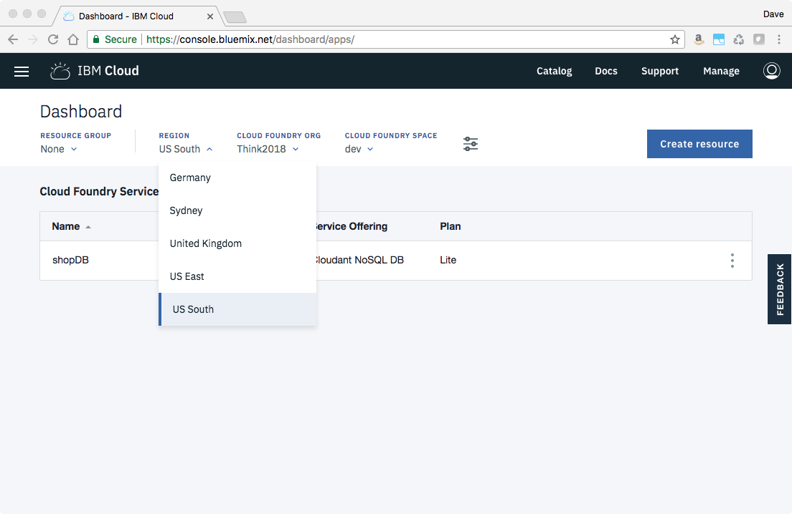
6. Open up a Terminal (CLI) window by clicking on the icon in your desktop. (You might need to move or minimize the browser window to see the desktop icon)

Our GitHub repository has all the terraform definition files ("resource files" for our lab already developed. Type in this command in the terminal to copy the repository into your local environment:

```
git clone https://github.com/IBMTerraform/terraform-workshop
```

Now you are ready to create your first IBM Cloud resource

## Exercise 1 - Deploying a Cloudant Instance

Change into the `ex01` directory by entering this command into the terminal:

```
cd terraform-workshop/ex01
```

The whole idea behind _infrastructure as code_ is to describe *what* you want your application environment to look like and then let a tool like terraform figure out how to best give you that. The "how" is always a combination of creating, deleting, and updating resources. The point here is that terraform takes care of the "how" -- you just specify "what" you ultimately want.

If you list the contents of the directory with an `ls` command in the terminal you will see that there are a few `.tf` files there. Before we look at these in depth enter these terraform commands into the terminal: `terraform init` followed by `terraform plan`.

During the run of `terraform plan` the system will ask you for your IBM Cloud account `org` and `space`. Enter these in. 

Your output will look something like this:

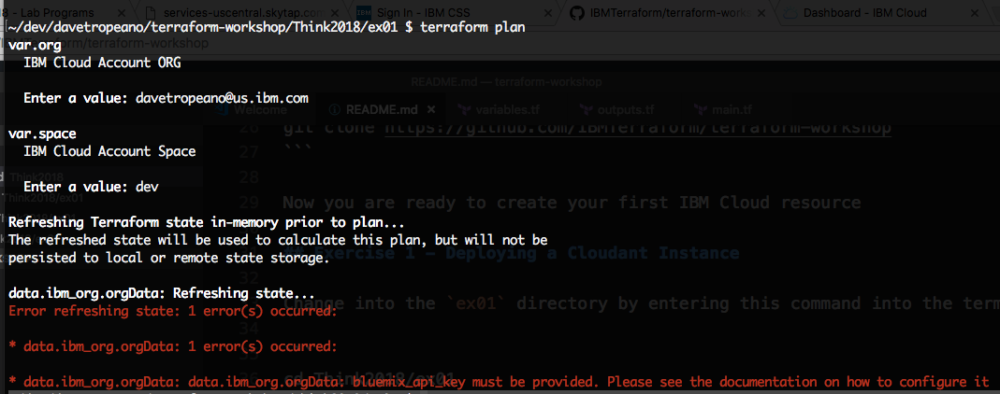

There's an error -- you haven't given terraform a Bluemix API key. 

### Generating an API Key

In order to create or delete an IBM Cloud service like Cloudant you need to provide terraform with a Bluemix API key. 

(This is true for ANY IBM Cloud service in the catalog)

You can use the IBM Cloud dashboard UI to generate an API key or you can do it from the command line. Let's use the terminal. Enter this command:

```
bx iam api-key-create think2018
```

Your output will look something like this:

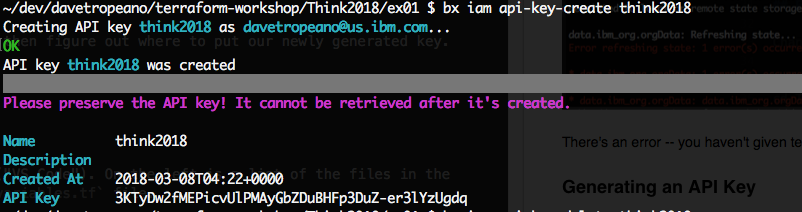

Let's open up our code editor and then figure out where to put our newly generated key. Enter this command:

```
code .
```

This brings up VisualStudio Code ("VS Code"). On the left is a list of the files in the current directory. Click on the `variables.tf` file. 

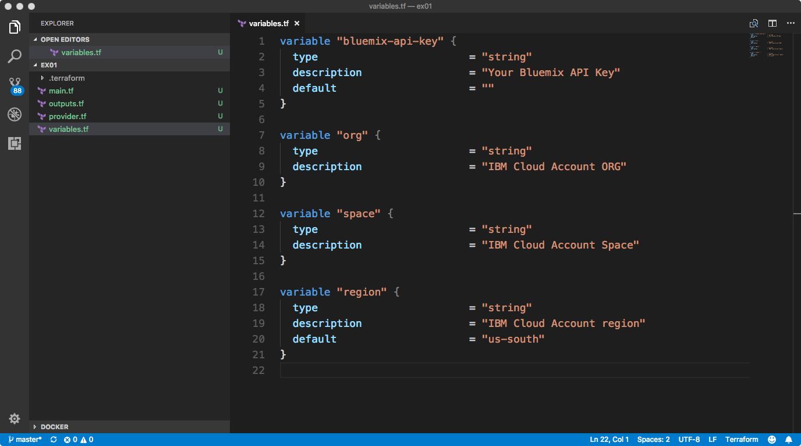

Replace the value of the variable "bluemix-api-key" with the API key you just generated (HINT: just go back to the terminal and copy/paste the value of the API key into VS Code).

Do a `File|Save` to save your changes 

### Generating a Plan

There are two main terraform commands: `plan` and `apply`. The `plan` command describes what changes terraform will make to your infrastructure. No changes are actually made -- `plan` is just a "dry run" and is useful as a check to make sure that the expected things are being created, deleted, and modified.

Now that we have our API key, org, and space entered in let's try and generate the plan again. Run the `terraform plan` command again:

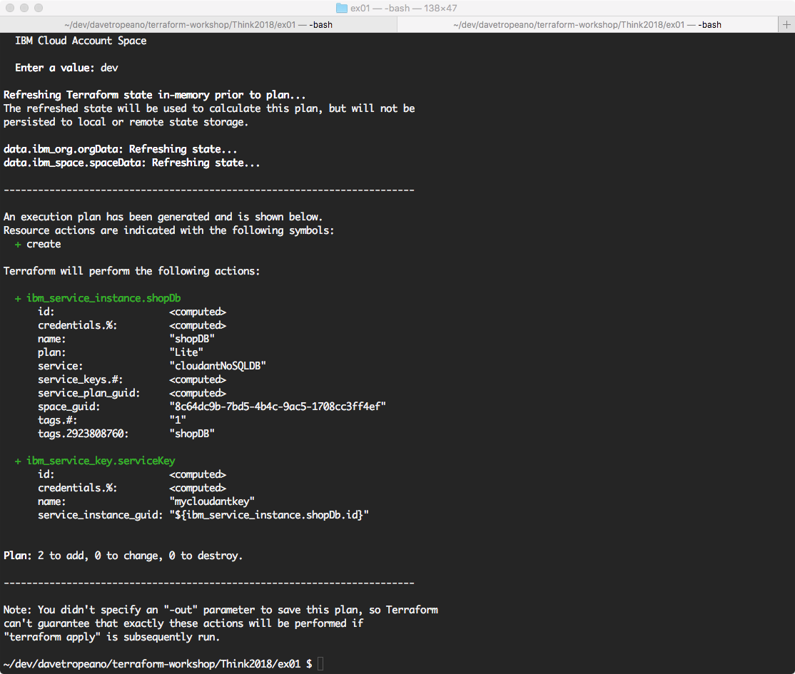

Success! Terraform tells me that it will create two resources:

- a _service instance_ called `shopDb` for the `cloudantNoSQLDB` service using the `Lite` billing plan
- a _service key_ called `mycloudantkey` that has all the needed access credentials to use the Cloudant database

### Applying a Plan

The `apply` command actually goes out and creates, deletes, and modifies the infrastructure. Our plan seems fine so let's go and apply it:

```
terraform apply
```

After a minute or two you'll get an output that looks similar to this:

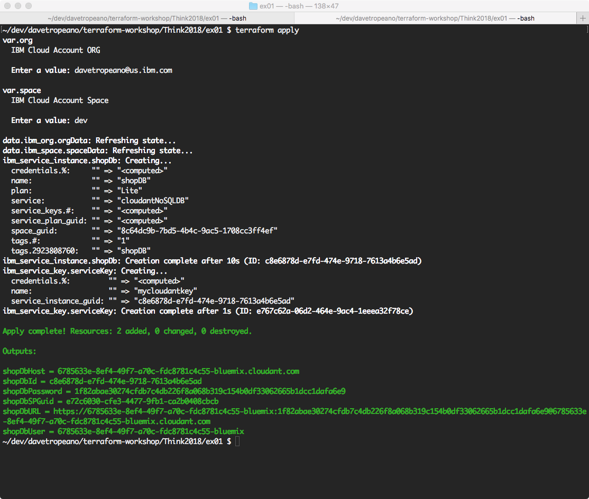

Success! You've just used terraform to create a new instance of a Cloudant database.

Bring up your browser again and refresh the tab that has your IBM Cloud dashboard in it. Scroll to the section "Cloud Foundry Services" and you'll see the shopDB terraform just created listed!

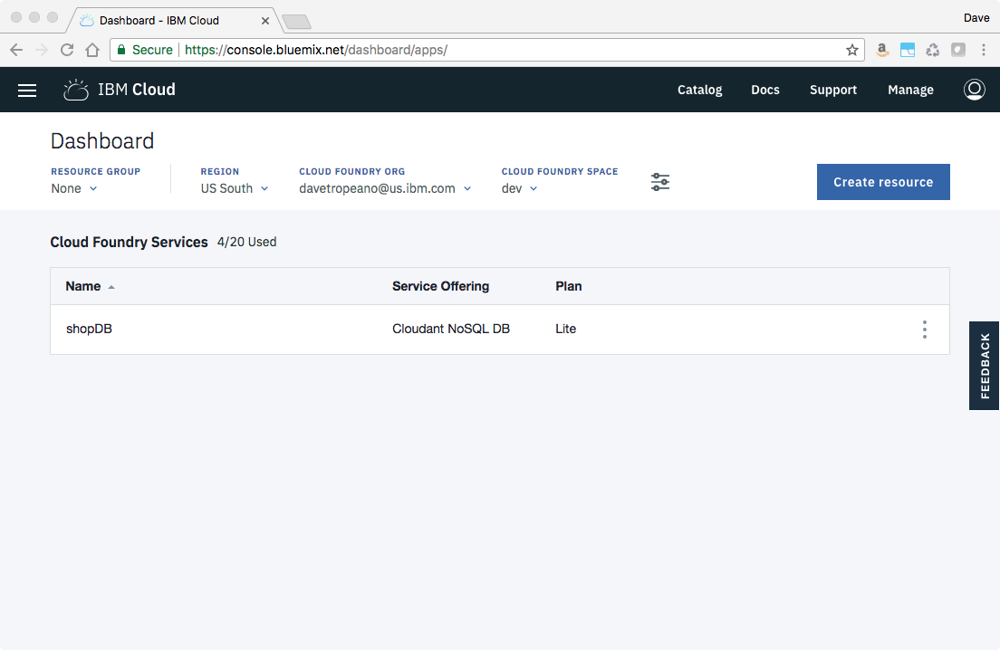

### How Did That Happen?

Let's take a deeper look at how terraform knew to create a Cloudant instance.

In there `ex01` directory there are four (4) main terraform files:

- main.tf
- outputs.tf
- provider.tf
- variables.tf

A directory in terraform terminology defines _module_. A module consists of one or more terraform resources files (`.tf` files). You could have one big file or split things up into mulitple small files. Here we split things up into four files according to their purpose.

_Open VS Code back up and click on each file to view it's contents to follow along with the discussion..._

Terraform can create and manage infrastructure resources from all the major cloud vendors. In the `provider.tf` file we declare that we are using the "ibm" provider and give it two needed parameter values:

- Bluemix API Key
- IBM Account Region

Instead of hard coding the API key and region values in the file we use variables for these. This way we can reuse the same provider file across multiple accounts and regions. (more on this later)

You already saw in the `variables.tf` file that we declared four variables: `bluemix-api-key`, `my-org`, `my-space`, and `region`. All variables have a name. Optionally variables can have a `type`, `description`, and `default` value. You get the value of a variable using the _interpolation syntax_ `${var.NAME}` where `NAME` is the name of the variable.

|NB: You can learn more about variable definitions in the [Terraform |documentation on input variables](https://www.terraform.io/docs/configuration/variables.html)

The `main.tf` file is where we declare what infrastructure resources we want. The name of the file is somewhat arbitrary -- we could have called it `cloudant.tf` or `foo.tf` for that matter.

In the `main.tf` file there are two resources declared, a _service instance_ and a _service key_. Service instances refer to ANY IBM Cloud service listed in the IBM Cloud catalog. (you can browse the catalog from the dashboard UI). Service keys contain all the credentials to access that service.

There are also two data elements declared in `main.tf` -- one for `org` and one for `space`. Data elements make it easier to access internal elements about services and your IBM Cloud Account. For example, in order to create a _service instance_ you need to provide the account's _space GUID_. That's a long string like "8c64dc9b-7bd5-4b4c-9ac5-1708cc3ff4ef". Instead of having to know that value you can just provide the name of the space and let terraform look it up and create a data structure that has the name, GUID, and other information related to your account space together. 

Finally, the `outputs.tf` file lists a series of outputs we want the terraform `apply` command to give us when it finishes. Again, the name of the file is not special. What is important is that the file contains a series of `output {}` declarations. Here we are outputing all the `service key` information needed to access the Cloudant database we created.

When you execute the `terraform apply` command terraform reads all the `.tf` files into memory and created a dependency map of all the resources, variables, and data structures you've defined. If it doesn't have a default value to use for a variable it asks you to input a value. Then it uses the IBM Cloud Provider to actually create the resources in the order they need to be created. Finally, any output values are written out to _stdout_ so they can be read or used by another script.

### The IBM Cloud Provider Documentation

The IBM Cloud Provider is the middleware that lets Terraform orchestrate the management of IBM Cloud resources. The provider defines a list of resource types and their parameters any time you want to create a resource of that type.

For example, if you want to create an instance of an IBM Cloud service like Cloudant you need to provide a name, space GUID, service type, and billing plan. You know this by browsing through the IBM Cloud Provider documentation.

Click on [this link](https://ibm-cloud.github.io/tf-ibm-docs/v0.7.0/r/service_instance.html) to open a new tab in the browser and look through the documentation for the _service instance_ resource.

The "homepage" of the IBM Cloud Provider is https://ibm-cloud.github.io/tf-ibm-docs. Every IBM Cloud resource that terraform supports is there. The provider is an opensource project and is updated regularly to include new resources and fix defects as needed.

### Destroying Resources

In the terminal perform a `terraform destroy` command to clean up this exercise. You will be asked to confirm that you want to destroy the resources -- type "yes" to confirm.

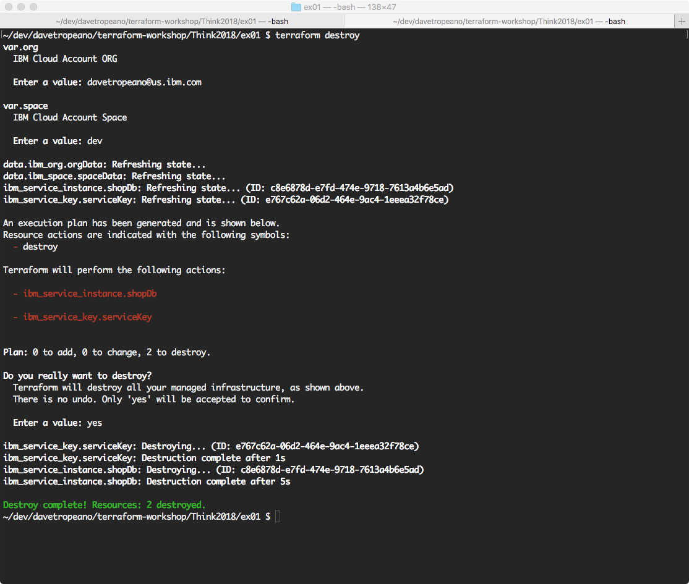

## Exercise 02 - Creating an IBM Containers Cluster

In this exercise you will use terraform to create an IBM Containers cluster with a single worker node. You will also learn about the best practices for refactoring variables definitions and values to maximize reuse.

First, change to the `ex02` directory and run the `terraform init` command to initialize the directory with the needed cloud providers for terraform.

```
cd ../ex02
terraform init
```

Open up a new VS code workspace with a `code .` command and click on the `terraform.tfvars` file to view it.

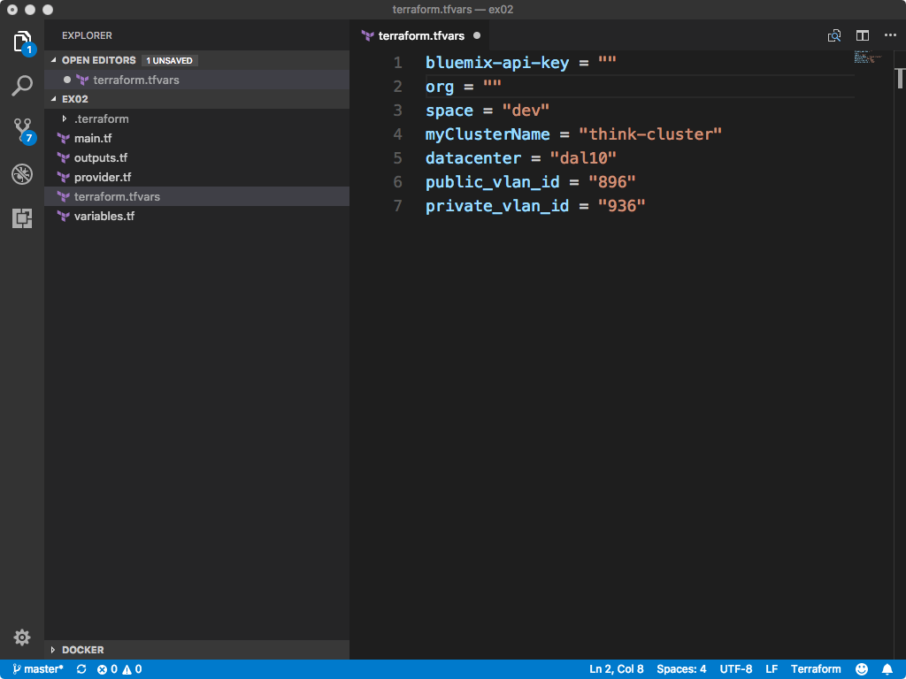

Any file with a `tfvars` extension is used to initialize the values of variables. You DO NOT typically version control your _tfvars_ file. They stay local to your system.

The value of using a _tfvars_ file is that you can separate variable *declaration* (and default values) with the *actual* values you want to use in this instance. This makes it easier to modify configuration parameters without requiring new branches and check ins to version control.

The `terraform.tfvars` file is just a list of `key = value` pairs. Edit the file so it includes the proper Bluemix API key, region, org, and space.

_NB: Typically your would NOT place your tfvars file under version control since this contains private information like API keys. We are just including the file here in the workshop for example purposes._

Now run a `terraform plan`. Your output will look something like this:

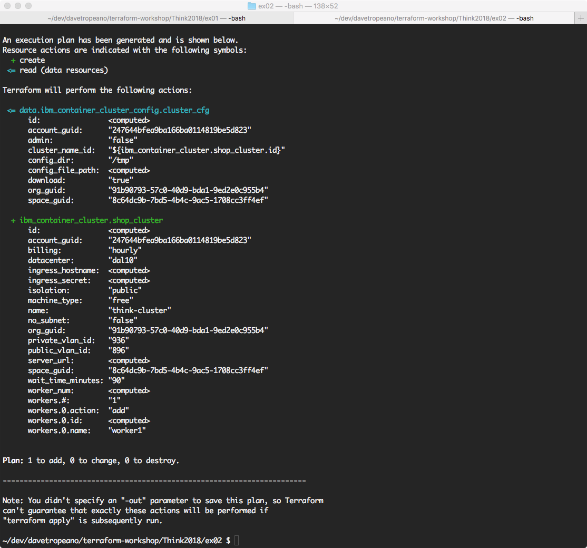

If everything looks good you can go ahead and run a `terraform apply`.

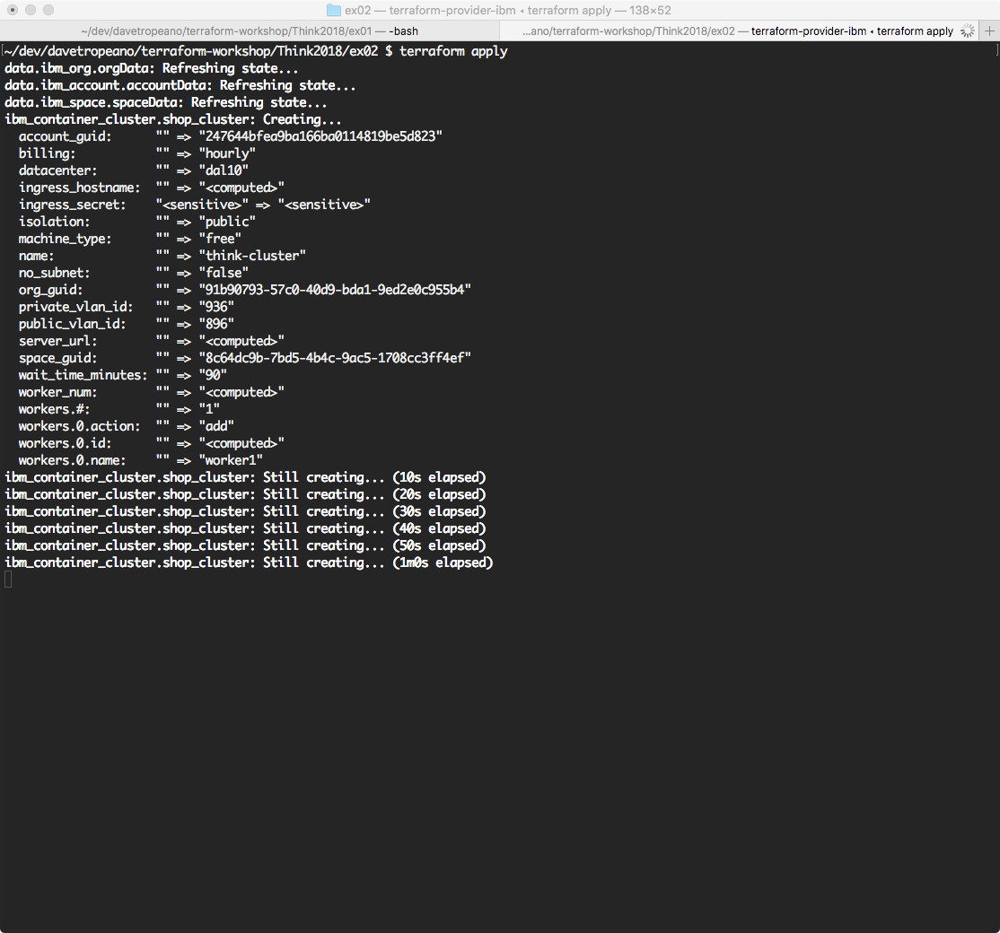

Creating a container cluster can take 5-10 minutes. While you are waiting go to the IBM Cloud Provider documentation for `container_cluster` and look through all the options you have to configure the cluster:

- [container_cluster docs](https://ibm-cloud.github.io/tf-ibm-docs/v0.7.0/r/container_cluster.html)
- [container_cluster\_config docs](https://ibm-cloud.github.io/tf-ibm-docs/v0.7.0/d/container_cluster_config.html)

Then spend some time in the VS Code editor looking at the `main.tf` file where we define the container resource terraform is creating.

Once the cluster is created you can go back to your IBM Cloud dashboard UI and see it listed in the "Clusters" section.

### Destroying the Container Cluster

In the terminal perform a `terraform destroy` command to clean up this exercise. You will be asked to confirm that you want to destroy the resources -- type "yes" to confirm.


## Exercise 03 - Creating a Loadbalancer and Back End Group of VMs

In this exercise we will be looking at a larger set of IBM Cloud resources that are configured to work together. You will use terraform to create a front end loadbalancer and back-end group of virtual machines.

Change to `ex03` directory and run `terraform init`. Open a new VS Code window for this exercise and modify the `terraform.tfvars` files with the correct Bluemix API key, org, space, and Softlayer user account name and API Key.

_NOTE: you will be given Softlayer credentials for this exercise by your lab instructor. If credentials are not available you can read through the description here and the terraform files and get 99% of the value_

```
cd ../ex03
terraform init
code .
```

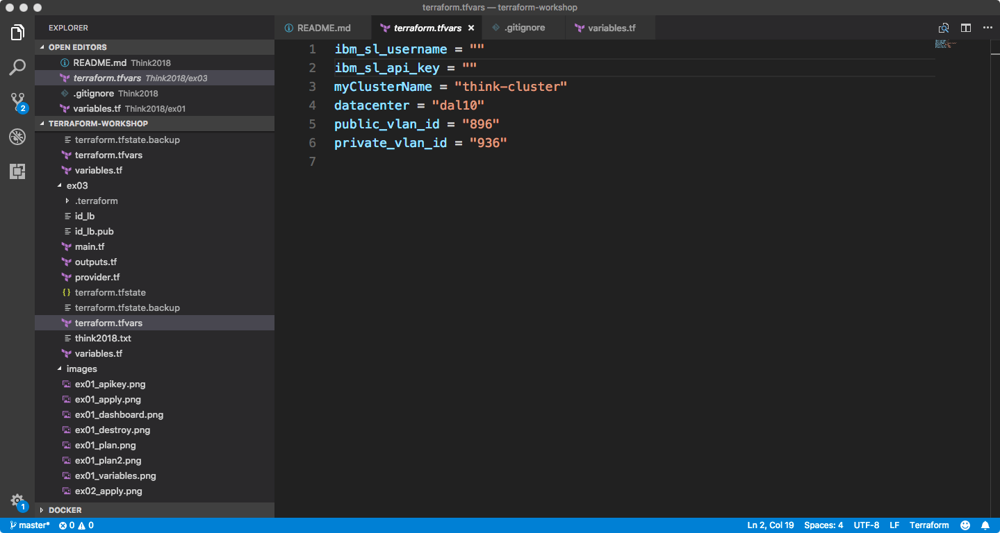

Look over the documentation of the new resources you will be creating:

- [load balancer](https://ibm-cloud.github.io/tf-ibm-docs/v0.6.0/r/lb.html)
- [load balancer service](https://ibm-cloud.github.io/tf-ibm-docs/v0.6.0/r/lb_service.html)
- [load balancer service group](https://ibm-cloud.github.io/tf-ibm-docs/v0.6.0/r/lb_service_group.html)
- [ssh key](https://ibm-cloud.github.io/tf-ibm-docs/v0.6.0/r/compute_ssh_key.html)
- [virtual machine](https://ibm-cloud.github.io/tf-ibm-docs/v0.6.0/r/compute_vm_instance.html)

This lab does not cover the details of each service but at a high level you are defining a load balance service to split incoming traffic load across a set of virtual machines. Each virtual machine has an SSH key you can use to log into the machine.

## Counting and Generating Random Names

In the previous exercises terraform created a single resource with a unique name that you provided. Here we want to create a pool of virtual machines using a reusable resource definition. This way the dev environment can create 2 VMs for development, staging 5, while pre-prod and production environments deploy 10 (or whatever the real values are).

There is a terraform provider called "random" that generates random identifiers that can be used as a prefix or suffix to a base name. You can learn more about the random provider [here](https://www.terraform.io/docs/providers/random/index.html).

In this exercise the `compute_vm_instance` resource definition uses the random provider in just this fashion (see `main.tf`):

```
resource "ibm_compute_vm_instance" "node" {
  # number of nodes to create, will iterate over this resource
  count                       = "${var.node_count}"
  # demo hostname and domain
  hostname                    = "node-${random_id.short_id.id}"
  domain                      = "mybluemix.net"
  ...
```

the `hostname` parameter of the VM will be a name like "node-X34B" because of the use of the `random_id` resource in the definition of hostname.

There is another "tricky" thing happening here. Terraform is using this resource definition of a VM in a loop. There is a pseudo-variable for all resources called `count` that acts like a loop or counter.

If you set `count` to 0 then the resource is not created (or it is deleted if it already exists). If you set it to 1 then a single instance is created. If you set it to a value greater than 1 then that resource definition is instantiated `count` times. 

By combining `count` with `random_id` you can ensure a unique name for each resource even if they are of the same resource type.

### Deploying Code and Initializing a Resource

It is common to want to initialize a resource after it has been created. Terraform has the notion of _provisioners_ to handle this situation. A "provisioner" in the terraform world refers to a script that runs after a resource is created.

There are prebuilt provisioners for _chef_ and _salt_. These are documented in the provisioners section of the main Terraform docs [here](https://www.terraform.io/docs/provisioners/index.html).

The generic case of provisioner is an "exec" provisioner and there are two types:

- local_exec where a script or program is run from your host machine to configure a resource
- remote_exec where a script or program is run *on the resource* itself to configure the resource

If you look at the `compute_vm_instance` definition in `main.tf` you will see a "provisioner" section in the resource definition:

```
  provisioner "remote-exec" {
    connection {
        type                  = "ssh"
        user                  = "root"
        private_key           = "${file("${path.module}/id_lb")}"
    }
    inline                    = [
      "apt-get update -y",
      # Install docker
      "wget -qO- https://get.docker.com/ | sh",
      "apt-get install --yes --allow-downgrades --allow-remove-essential --allow-change-held-packages  docker-compose",
      # Install docker-compose
      "COMPOSE_VERSION=`git ls-remote https://github.com/docker/compose | grep refs/tags | grep -oP \"[0-9]+\\.[0-9][0-9]+\\.[0-9]+$\" | tail -n 1`",
      "curl -L https://github.com/docker/compose/releases/download/$${COMPOSE_VERSION}/docker-compose-`uname -s`-`uname -m` > /usr/local/bin/docker-compose",
      "chmod +x /usr/local/bin/docker-compose",
      "curl -L https://raw.githubusercontent.com/docker/compose/$${COMPOSE_VERSION}/contrib/completion/bash/docker-compose > /etc/bash_completion.d/docker-compose",
      # Start the fulfillment apply
      "docker run -d -p 3000:3000 mkubik/ship"
    ]
  }
```

This is a _remote-exec_ provisioner that runs after the virtual machine has been created. The provisioner SSH's into the VM and runs a script that installs a set of application software on the VM. 

If you were provisioning something like a Cloudant database instance there is no concept of "remote-exec" common to all IBM Cloud services. In the case of an IBM Cloud service like Cloudant you would use a local exec provisioner to load the database with records, etc. for initialization.

### Plan, Apply, Destroy

You can go ahead and run through the usual cycle of terraform commands to create the pool of virtual machines and front end load balancer:

```
terraform plan
....
terraform apply
....
terraform destroy
...
```

## Wraping Up

You made it!

In this lab you've learned how to use terraform to create IBM Cloud services like Cloudant, Container clusters, virtual machines, loadbalancers, and even SSH keys. Along the way you've learned about separating variable declarations from actual values, how to use the `count` variable as a looping construct, and how to generate random names.

Congratulations.

Terraform is a rich tool with a lot of features and capabilities. We have only scratched the surface here with what you can do with Terraform and the IBM Cloud Provider. For more information see these resources:

- [IBM Cloud Provider Documentation](https://ibm-cloud.github.io/tf-ibm-docs/)
- [IBM Cloud Provider Repository](https://github.com/Cloud-Schematics)
- [Terraform Documentation](https://www.terraform.io/docs/index.html)
- [Terraform Up and Running](http://amzn.to/2HdwHnJ)
- [Infrastructure as Code: Managing Servers in the Cloud](http://amzn.to/2oSp9jj)

